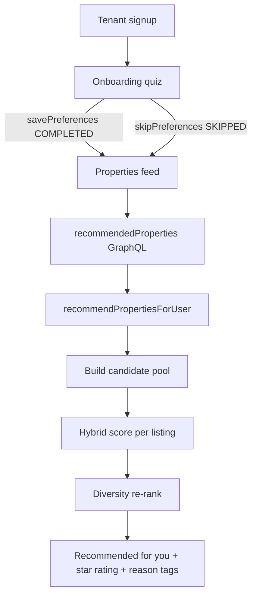

# FieConnect Recommendation System

How tenant listing recommendations work, what signals they use, and where the code lives.

## Purpose

Recommend rental listings to **TENANT** users in ranked order — “homes that fit you best” — using:

1. Explicit preferences from a skippable onboarding quiz  
2. Implicit behavior (views, saves, applications)  
3. Similar tenants’ activity  
4. Location, freshness, landlord quality, and current search filters  

Landlords get a simple newest-listings fallback (not personalized).

---

## High-level flow



---

## Data model

### User preferences (`User.preferences`)

Embedded on [`backend/src/models/User.ts`](../src/models/User.ts):

| Field | Type | Role |
|-------|------|------|
| `regions` | `string[]` | Preferred Ghana regions |
| `districts` | `string[]` | Preferred districts |
| `types` | `string[]` | Apartment, House, Studio, … |
| `minPrice` / `maxPrice` | `number \| null` | Budget (GHS) |
| `bedrooms` | `string[]` | e.g. `["1","2","3"]` |
| `amenities` | `string[]` | Overlap with listing amenities |
| `parking` | `string \| null` | `"Yes"` / `"No"` |
| `onboardingStatus` | enum | `PENDING` \| `COMPLETED` \| `SKIPPED` |

Defaults: tenants start `PENDING`; landlords are marked `COMPLETED` on register (quiz skipped for them).

### Property interactions

[`backend/src/models/PropertyInteraction.ts`](../src/models/PropertyInteraction.ts) logs weighted events:

| Type | Weight | When written |
|------|--------|----------------|
| `APPLY` | 1.0 | `createApplication` |
| `SAVE` | 0.7 | `toggleSaveProperty` (add) |
| `VIEW_LONG` | 0.35 | View with dwell ≥ 30s |
| `VIEW` | 0.15 | Property detail opened |
| `UNSAVE` | −0.4 | `toggleSaveProperty` (remove) |
| `REJECT_OUTCOME` | −0.55 | Application status → `REJECTED` |

Weights are multiplied by **time decay** (half-life ≈ 21 days) at scoring time.

---

## GraphQL API

Defined in [`backend/src/graphql/typeDefs.ts`](../src/graphql/typeDefs.ts).

### Queries

```graphql
recommendedProperties(
  limit: Int
  region: String
  type: String
  minPrice: Float
  maxPrice: Float
): [RecommendedProperty!]!
```

Returns:

```graphql
type RecommendedProperty {
  property: Property!
  score: Float!       # hybrid ranking score
  stars: Int!         # 0–5 preference match rating for the card
  reasons: [String!]! # short explainability tags
}
```

Optional `region` / `type` / price args are **session search filters** from the properties page — they boost matching listings without overwriting saved prefs.

### Mutations

| Mutation | Effect |
|----------|--------|
| `savePreferences(input)` | Upserts preference fields; sets `onboardingStatus = COMPLETED` |
| `skipPreferences(input?)` | Optional partial picks + `onboardingStatus = SKIPPED` |
| `trackPropertyView(propertyId, durationSec?)` | Writes `VIEW` or `VIEW_LONG` |

Resolver entrypoints: [`backend/src/graphql/resolvers.ts`](../src/graphql/resolvers.ts)  
Core logic: [`backend/src/services/recommendProperties.ts`](../src/services/recommendProperties.ts)

---

## Scoring algorithm

Entry: `recommendPropertiesForUser(userId, options)`.

### 1. Load tenant context

- Preferences from `User`
- Non-rejected applications + rejected IDs  
- Interaction history (last 500)  
- Saved property IDs  

**Content matching is on** whenever any preference field is non-empty — including after skip if the tenant picked something during the quiz.

If budget prefs are empty, budget is **inferred** from application `monthlyIncome` (~20–40% of average income).

### 2. Candidate pool

Union of:

- Newest ~150 listings  
- Listings in preferred regions  
- Platform-popular by save count  
- Random exploration sample (~25)  
- Listings the user already interacted with positively  

Exclude listings the tenant has already applied to (non-rejected). Cap / dedupe by id.

### 3. Component scores (each ~0–1)

| Component | What it measures |
|-----------|------------------|
| **Content** | **Cosine similarity** between the tenant preference vector and the listing feature vector (region, district, type, bedrooms, budget soft-fit, amenities, parking) |
| **Location** | Preferred region/district; Haversine proximity to mean lat/lng of liked listings |
| **Collaborative** | User–user **cosine** on weighted interactions (+ region overlap); else popularity |
| **Item similarity** | Similarity to listings the user liked (type, geo, price band, amenity cosine, about text cosine) |
| **Freshness** | Newer listings score higher (~90-day fade) |
| **Quality** | Verified + landlord approval rate from applications |
| **Session** | Boost for current search filters |

Penalties: already saved, recently viewed, same landlord/district as rejected apps.

**Preference vectors:** each active preference dimension becomes a feature weight on the tenant side; the listing gets matching weights (0–1 soft values for budget). Ranking content score is:

\[
\cos(\mathbf{u}, \mathbf{p}) = \frac{\mathbf{u}\cdot\mathbf{p}}{\|\mathbf{u}\|\,\|\mathbf{p}\|}
\]

**Star rating:** the preference hit ratio (matched dims ÷ active dims) is mapped to 1–5 stars with `ceil(ratio × 5)` — e.g. matching **7 of 8** prefs → **5★**, matching **4 of 8** → **3★**. Stars appear on recommended property cards. When prefs are empty, stars fall back from the overall hybrid score.

### 4. Mode weights (then normalized)

| Mode | When | Emphasis |
|------|------|----------|
| Prefs + history | Has preference fields | Content heavy (~0.4) |
| Behavior only | No prefs, has saves/views/applies | Collab + item-sim + location |
| Cold start | No prefs, no positive affinity | Popularity + Greater Accra / phone-inferred region + freshness |

Cold-start region: prefer Ghana (`+233`) market popularity, else default **Greater Accra**.

### 5. Diversity re-rank

Greedy pick: at each step choose the highest score minus a penalty for similarity to already-picked items (same region/district/type/bedrooms). Returns top `limit` (default 12).

### 6. Reasons

Up to 3 short strings per result, e.g.:

- “Matches your budget”  
- “In East Legon”  
- “Similar to a listing you liked”  
- “Popular with tenants like you”  
- “Verified listing”  

---

## Frontend wiring

| Piece | Path | Role |
|-------|------|------|
| Onboarding quiz | `frontend/src/app/app/onboarding/page.tsx` | Fullscreen 3-step chip quiz; skip saves partial picks |
| Soft nudge | `frontend/src/components/onboarding-nudge-banner.tsx` | Shown when `PENDING` |
| Feed | `frontend/src/app/app/properties/page.tsx` | Calls `recommendedProperties` with active filters |
| Reason chips / stars | `frontend/src/components/property/property-card.tsx` | `reasons` + `stars` props |
| View tracking | `frontend/src/app/property/[id]/page.tsx` | `trackPropertyView` on open / long dwell |
| Prefs editor | `frontend/src/app/app/profile/page.tsx` | Edit prefs later |
| Operations | `frontend/src/graphql/operations.ts` | Queries/mutations |

Signup redirects tenants to `/app/onboarding`. The app layout hides the dashboard chrome on that route (fullscreen quiz).

---

## Tenant states cheat sheet

| State | Recommendations |
|-------|-----------------|
| Prefs completed with picks | Content + location + light collab + item-sim |
| Skipped with partial picks | Same content path (prefs fields present) |
| Skipped / pending, no picks, has activity | Location inferred from history + collab-heavy |
| Brand new cold start | Popularity + verified + Accra-ish default + fresh |
| Landlord | Newest listings only |

Browsing/search always works; recommendations never hard-block the app.

---

## How it was coded (architecture notes)

1. **No external ML service** — pure TypeScript + MongoDB in-process scoring.  
2. **Thin resolvers, fat service** — GraphQL only auth + arg plumbing; ranking lives in `recommendProperties.ts`.  
3. **Shared formatters** — `formatUser` / `formatProperty` / `formatPreferences` keep preference fields consistent.  
4. **Hybrid, not pure CF** — content and collab both run; weights shift by cold-start vs prefs mode.  
5. **Explainability first-class** — API returns `stars` + `reasons`, not only ids.  
6. **Interactions as event log** — saves/applies still update `User.savedProperties` / `Application`; `PropertyInteraction` is the recommender’s signal store.  
7. **Search-aware without writing prefs** — filter args on the query act as soft session boosts.

### Key helpers in the service

- `cosineSimilarity` — sparse preference / feature vector cosine  
- `setCosine` — binary multi-hot cosine for amenities, similar tenants, text tokens  
- `scoreToStars` — map preference hit ratio → 1–5★  
- `haversineKm` — geo proximity  
- `timeDecay` — exponential half-life on interactions  
- `itemSimilarity` — listing-to-listing likeness  
- `diversify` — MMR-style re-rank  
- `trackPropertyView` — write VIEW / VIEW_LONG  

---

## Extending later

Good next steps (not implemented):

- Neural embeddings / two-tower models  
- Precomputed user–item matrices + Redis cache  
- Formal A/B tests and offline precision@k eval on held-out interactions  
- Real geocoding on listing create (beyond region centroids)  

The `PropertyInteraction` collection is the training log for those upgrades.
